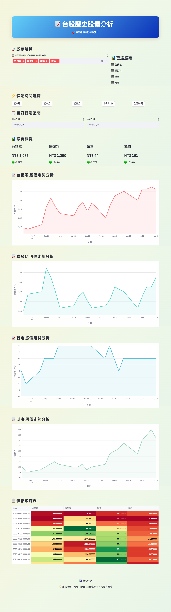

# 📈 台股歷史股價分析平台

## 專案簡介

本專案是一個以 Python Streamlit 打造的台灣上市公司股價資料視覺化分析平台，支援多檔股票同時比較、快速時間區間選擇、互動式圖表展示與美觀的自訂主題。數據來源自 Yahoo Finance，讓投資人與資料分析師能輕鬆探索台積電、聯電、聯發科、鴻海等台股龍頭的歷史走勢。

👉 **[立即線上體驗](https://pythonfordataanalysis.onrender.com/)**

---

## 主要功能

- 📥 自動下載台股歷史股價（台積電、聯電、聯發科、鴻海）
- 🗂 多股票選擇與比較，支援多檔同時分析
- 🕒 快速時間區間切換（近一週、一月、三月、今年以來、全部）
- 📅 自訂起訖日期，靈活篩選分析區間
- 📊 互動式走勢圖（Plotly），支援縮放、滑鼠懸浮顯示
- 🟢🔴 投資報酬率概覽，自動計算選定區間的漲跌幅
- 📋 數據表格展示，支援顏色漸層高亮
- 🎨 美觀自訂主題與介面設計，提升使用體驗

---

## 技術細節

- **前端框架**：Streamlit
- **資料來源**：Yahoo Finance（yfinance 套件）
- **資料處理**：Pandas
- **互動圖表**：Plotly
- **自訂樣式**：CSS（內嵌於 Streamlit）
- **部署**：Render.com

---

## 如何使用

1. 安裝依賴套件
   ```
   pip install streamlit yfinance pandas plotly
   ```
2. 執行程式
   ```
   streamlit run app.py
   ```
3. 開啟瀏覽器，進入 [http://localhost:8501](http://localhost:8501)

---

## 線上展示

👉 **[點此體驗線上版](https://pythonfordataanalysis.onrender.com/)**

---

## 注意事項

- 資料僅供參考，投資需謹慎，盈虧自負。
- 本平台僅支援部分台灣股票（可於程式碼中自行擴充）。
- 數據來源自 Yahoo Finance，若遇到下載失敗請稍後再試。

---

## 預覽畫面


